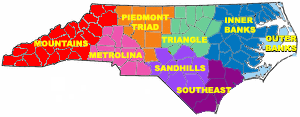
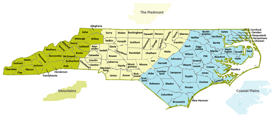
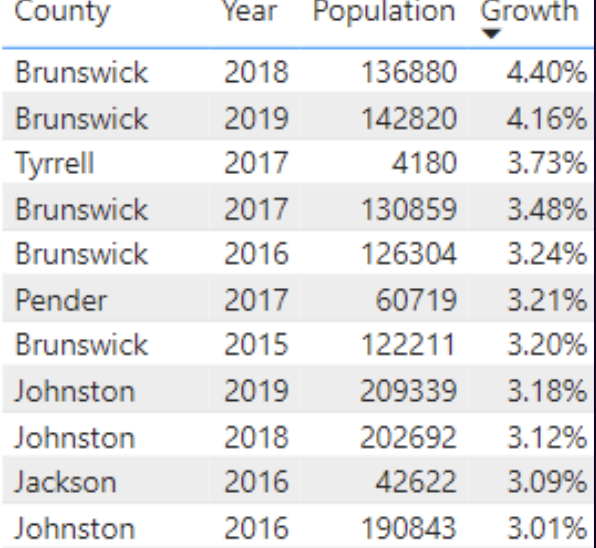
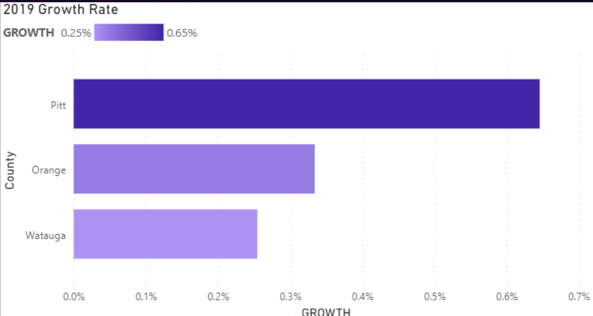
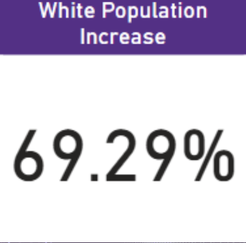
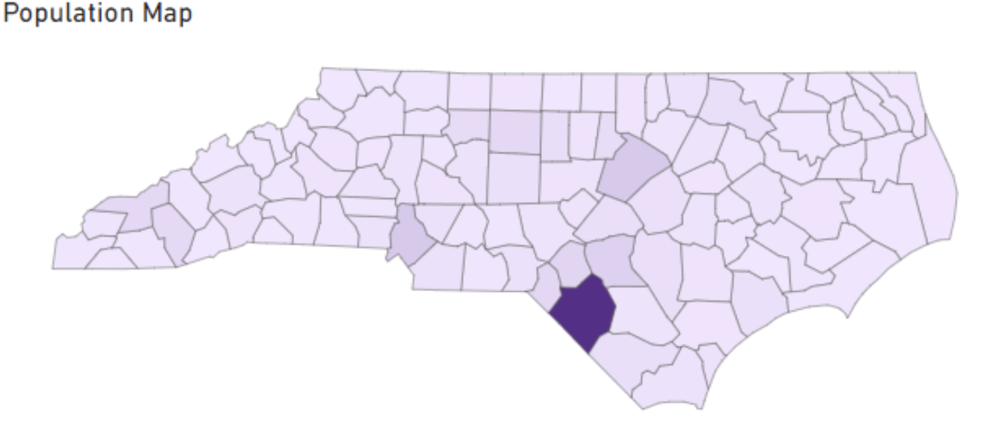
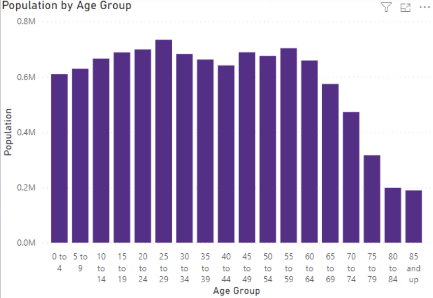
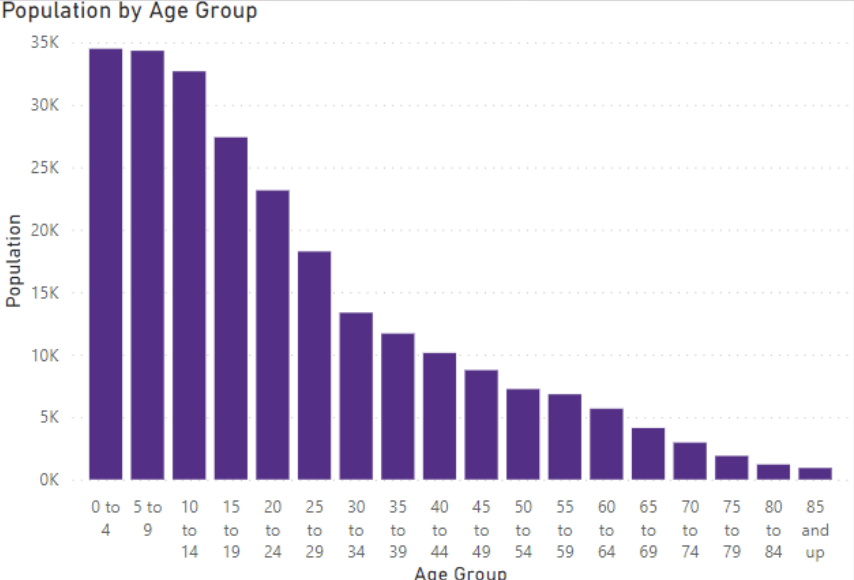

# Local Census Data Analysis

## Problem
* Census data for local communities is spread out across many data sources/websites.
* This makes it difficult for the average citizen to access data about their community, and find out ways the community needs support and resources.

## Research Question
* What's the growth of Eastern North Carolina compared to the rest of the state?
    * North Carolina is considered to be one of the fastest growing states, but is growth equally distributed?
    * Wich areas are falling behind compared to the rest of the state?
    * Are we performing well compared to other NC areas, if well, does this come at a cost?
    * What ethnic groups are moving in versus out?
    * What do income levels look like per ethnic group?

## Data Sources
* [FRED Economic Data](https://fred.stlouisfed.org/searchresults?st=building%20permit&t=county%3Bnc&ob=sr&od=desc)
    * Authorized Building Permits per County in NC
* [United States Census Bureau](https://www.census.gov/data/developers/data-sets/popest-popproj/popest.html)
    * Populated Estimate per County in NC
* Economic Regions
    * [Prosperity Zones](https://www.commerce.nc.gov/about-us/nc-prosperity-zones#socen) in NC
    * [Metropolitan](https://www.commerce.nc.gov/blog/2014/12/10/breaking-out-hard-do-how-nc-divided-regions#:~:text=Classifications%20worthy%20of%20note%20for%20North%20Carolina%20include%3A) zones in NC

## Dataset

Population tables:
* have a population table for each state
* split population into date tables
* have a population table where it has population for each county in North Carolina for 2019 and 2015
* separate into respective ethnic groups
* counties in inner banks (ENC)(REGION 1)
* counites in outer banks (ENC)(REGION 1)
* counties in southeast (ENC)(REGION 2)
* counties in sandhills (ENC)(REGION 3)
* counties in triangle (MIDDLE)(REGION 4)
* counties in piedmont triad (MIDDLE)(REGION 5)
* counties in metrolina (MIDDLE)(REGION 6)
* counties in mountains (WESTERN)(REGION 7)

note: REGION refers to economical areas
i.e. inner banks and outers banks are separate geographic areas but considered part of the same economical region

Economic tables:
* total expenditure per county
* total investment per county and split into separate industries
* gross earnings per county and broken down into ethnic groups
* total renting per county broken down into ethnic groups 
* total house buying per county broken down into ethnic groups

> 💡 In 1993, the State Legislature established seven regional economic
> development organizations and three of these serve eastern North Carolina -
> Northeast North Carolina Commission (covering 16 counties), North Carolina
> East Alliance (representing 13 counties surrounding North Carolina's Global
> TransPark), and North Carolina's Southeast Commission (assisting 11
> counties)

[Learn more about Eastern North Carolina](https://en.wikipedia.org/wiki/Eastern_North_Carolina)

[Learn more about North Carolina's geography](https://www.ncpedia.org/our-state-geography-snap-three)

Data Cleaning
* Drop unneeded columns
* Rename used columns
* Update the values (i.e. country_name)
* Categorize the data (i.e. race)
* Add column that bins age groups

## Visualizations
* Power BI was used for creating visualizations.
* Some features utilized:
    * DAX formulas
    * Calculated Columns
    * Shape Maps
    * Filters and Slicers

## Analysis
Urban Population Growth
* Wake and Mecklenburg County
    * These counties had the most growth in population.
* Pitt County
    * Grew on par with other "college towns" (UNC, App State) if not better.

Race Population Growth
* Durham County
    * 70% of the increase in Durham County’s increase in population was white.
* Robeson County
    * American Indians and Alaskan Natives are highly concentrated in Robeson County, where the Lumbee Tribe is located.

Age Population Growth
* Elder
    * There was an increase in the amount of elders in the state.
* Race Distribution
    * there was an extreme increase in the "two or more races" category in younger generations. Other races had a similar distribution to the overall distribution.

